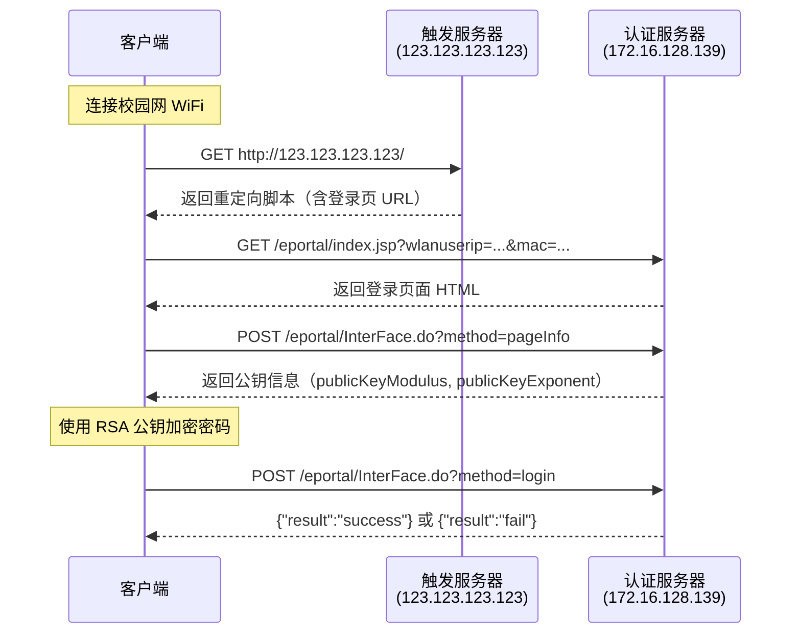

# 校园网认证流程分析

> 文档生成时间：2026-01-07  
> 基于 Wireshark 抓包分析  
> 本文档只负责说明协议、字段和抓包结论；日常使用方式请看 [README.md](./README.md)。

## 一、文档定位

- 当前项目实现的是 **Eportal 动态公钥认证流程**
- 唯一维护中的加密实现位于 `src/campus_login_tool/security.py`
- 根目录 `security.py` 仅保留为历史兼容 shim，不再是主实现

## 二、流程概览



## 三、抓包步骤

### 1. 触发认证

**请求：**

```http
GET / HTTP/1.1
Host: 123.123.123.123
```

**响应：**

```http
HTTP/1.1 200 ok
Server: Apache
Content-Length: 352
Cache-Control: no-cache
Connection: close

<script>top.self.location.href='http://172.16.128.139/eportal/index.jsp?wlanuserip=ba5369b73241a2e65f684af648c00705&wlanacname=6703bb7db3de7276f209958a3853c667&ssid=fa8cbcad3babdbfdf6138ca33d1cfce3&nasip=95360ffea11be0624509daaf4d05a4da&mac=5fdcd87b4a9fecfe22921ef5c80e86b4&t=wireless-v2&url=64d70091b1789d1742d40e96d136bc85e4dfbe7d34276b3e'</script>
```

**结论：**

- 未认证时，HTTP 请求会被劫持到 `123.123.123.123`
- 响应里并不是 302，而是内嵌 JS 跳转脚本
- 后续登录所需参数都来自这个跳转 URL

### 2. 访问登录页面

**请求：**

```http
GET /eportal/index.jsp?wlanuserip=ba5369b73241a2e65f684af648c00705&wlanacname=6703bb7db3de7276f209958a3853c667&ssid=fa8cbcad3babdbfdf6138ca33d1cfce3&nasip=95360ffea11be0624509daaf4d05a4da&mac=5fdcd87b4a9fecfe22921ef5c80e86b4&t=wireless-v2&url=64d70091b1789d1742d40e96d136bc85e4dfbe7d34276b3e HTTP/1.1
Host: 172.16.128.139
Cookie: JSESSIONID=...
```

**结论：**

- 登录页面正文通常是 gzip 压缩、GBK/GB18030 编码
- 认证服务器会设置 `JSESSIONID`，后续请求依赖同一会话

### 3. 获取公钥信息（pageInfo）

**请求：**

```http
POST /eportal/InterFace.do?method=pageInfo HTTP/1.1
Host: 172.16.128.139
Content-Type: application/x-www-form-urlencoded; charset=UTF-8
Origin: http://172.16.128.139
Referer: http://172.16.128.139/eportal/index.jsp?...

queryString=wlanuserip%3Dba5369b73241a2e65f684af648c00705%26wlanacname%3D6703bb7db3de7276f209958a3853c667%26ssid%3Dfa8cbcad3babdbfdf6138ca33d1cfce3%26nasip%3D95360ffea11be0624509daaf4d05a4da%26mac%3D5fdcd87b4a9fecfe22921ef5c80e86b4%26t%3Dwireless-v2%26url%3D64d70091b1789d1742d40e96d136bc85e4dfbe7d34276b3e
```

**响应：**

```json
{
  "portalUrl": "http://www.nudt.edu.cn",
  "passwordEncrypt": "true",
  "publicKeyExponent": "10001",
  "publicKeyModulus": "94dd2a8675fb779e6b9f7103698634cd400f27a154afa67af6166a43fc26417222a79506d34cacc7641946abda1785b7acf9910ad6a0978c91ec84d40b71d2891379af19ffb333e7517e390bd26ac312fe940c340466b4a5d4af1d65c3b5944078f96a1a51a5a53e4bc302818b7c9f63c4a1b07bd7d874cef1c3d4b2f5eb7871",
  "isAutoLogin": "false"
}
```

**关键字段：**

| 字段 | 说明 |
|------|------|
| `passwordEncrypt` | 是否需要加密密码 |
| `publicKeyExponent` | RSA 公钥指数，通常为 `10001` |
| `publicKeyModulus` | RSA 公钥模数，长度约 1024 位 |

### 4. 提交登录请求

**请求：**

```http
POST /eportal/InterFace.do?method=login HTTP/1.1
Host: 172.16.128.139
Content-Type: application/x-www-form-urlencoded; charset=UTF-8
Origin: http://172.16.128.139
Referer: http://172.16.128.139/eportal/index.jsp?...
Cookie: JSESSIONID=...

userId=wangsiyuan21a
&password=26dd73bec969a8b703002d0ab6e14a5781116f951010e63fef4d653ffcd458d4c1ac0ba449a69f09e52dcbb87a13d5694b8566d1a8b485ab0b26768309c824109d46e79c748cb78a0b71814ceb6d1563dddc85ab1d0971fbcefaacb359a6d0af7a1dd45b4ff030bba289788ce2b1edcea52fd3936e2b4160ec4ce240f17cc946
&service=
&queryString=wlanuserip%253Dba5369b73241a2e65f684af648c00705%2526wlanacname%253D...
&operatorPwd=
&operatorUserId=
&validcode=
&passwordEncrypt=true
```

**参数说明：**

| 参数 | 说明 |
|------|------|
| `userId` | 用户名 |
| `password` | RSA 加密后的密码 |
| `service` | 服务类型，可为空 |
| `queryString` | 登录页原始查询串的再次 URL 编码 |
| `passwordEncrypt` | 标记密码已按前端逻辑加密 |

**成功响应：**

```json
{
  "userIndex": "39353336306666656131316265303632343530396461616634643035613464615f31302e3132382e36332e3132325f77616e6773697975616e323161",
  "result": "success",
  "message": "",
  "forwordurl": null,
  "keepaliveInterval": 0
}
```

**失败响应：**

```json
{
  "result": "fail",
  "message": "用户名或密码错误"
}
```

## 四、URL 参数与返回字段

### URL 参数

从触发地址返回的登录页 URL 中，各参数都已经过处理：

| 参数 | 典型长度 | 说明 |
|------|----------|------|
| `wlanuserip` | 32 | 客户端地址的处理结果 |
| `wlanacname` | 32 | AC 名称的处理结果 |
| `ssid` | 32 | SSID 的处理结果 |
| `nasip` | 32 | NAS IP 的处理结果 |
| `mac` | 32 | 参与密码加密的标识，不是原始 MAC |
| `t` | 明文 | 典型值为 `wireless-v2` |
| `url` | 40 | 原始目标地址的处理结果 |

> 这里的 `mac` 不是物理网卡的原始 MAC 地址，而是认证流程里用于拼接密码的 32 字符值。

### `userIndex`

登录成功后返回的 `userIndex` 是十六进制字符串，解码后形如：

```text
<session_hash>_<client_ip>_<username>
```

示例解码结果：

```text
95360ffea11be0624509daaf4d05a4da_10.128.63.122_wangsiyuan21a
```

## 五、密码加密机制

### 加密流程

```text
原始密码 -> 拼接 mac -> 反转字符串 -> RSA 加密 -> 十六进制输出
```

### 详细步骤

1. 拼接 `password + ">" + mac`
2. 对拼接结果反转
3. 使用 `pageInfo` 返回的公钥执行 RSA 加密
4. 输出十六进制字符串

### 代码映射

当前项目中的真实实现位于 `src/campus_login_tool/security.py`：

```python
def encryptPassword(password, publicKeyExponent, publicKeyModulus, macString="111111111"):
    passwordMac = password + ">" + macString
    passwordEncode = passwordMac[::-1]
    setMaxDigits(400)
    key = RSAUtils.getKeyPair(publicKeyExponent, "", publicKeyModulus)
    return RSAUtils.encryptedString(key, passwordEncode)
```

## 六、其他接口

### 退出登录

**请求：**

```http
POST /eportal/InterFace.do?method=logout HTTP/1.1
Host: 172.16.128.139
Content-Type: application/x-www-form-urlencoded; charset=UTF-8

userIndex=39353336306666656131316265303632343530396461616634643035613464615f31302e3132382e36332e3132325f77616e6773697975616e323161
```

**响应：**

```json
{
  "result": "success",
  "message": "下线成功"
}
```

### 在线状态查询

**请求：**

```http
POST /eportal/InterFace.do?method=getOnlineUserInfo HTTP/1.1
Host: 172.16.128.139
Content-Type: application/x-www-form-urlencoded; charset=UTF-8

userIndex=39353336306666656131316265303632343530396461616634643035613464615f31302e3132382e36332e3132325f77616e6773697975616e323161
```

**响应：**

```json
{
  "userIndex": "3935336...3161",
  "result": "success",
  "message": "获取用户信息成功",
  "userName": "wangsiyuan21a",
  "userId": "wangsiyuan21a",
  "userIp": "10.128.63.122",
  "userMac": "e2100cc9fff9",
  "maxLeavingTime": "不限时长",
  "loginType": "3"
}
```

## 七、项目实现映射

| 项目步骤 | 抓包对应 | 当前实现 |
|----------|----------|----------|
| 访问触发地址 | 包 #488 | `CampusLoginClient._get_login_page_url()` |
| 解析登录页 URL | 触发响应 HTML | `CampusLoginClient._extract_redirect_url()` |
| 获取会话和登录页 | 包 #508 | `CampusLoginClient.login()` |
| 获取 `pageInfo` | 包 #594 / #597 | `CampusLoginClient._get_page_info()` |
| 本地加密密码 | 本地计算 | `campus_login_tool.security.encryptPassword()` |
| 提交登录 | 包 #968 / #976 | `CampusLoginClient._submit_login()` |

## 八、抓包时间线

### `log2.pcapng`（退出 -> 重新登录）

| 时间 | 包号 | 方向 | 请求/响应 |
|------|------|------|-----------|
| 0.37s | #12 | -> | POST `getOnlineUserInfo` |
| 3.79s | #233 | -> | POST `logout` |
| 3.81s | #238 | <- | `{"result":"success"}` |
| 5.63s | #473 | -> | GET `http://123.123.123.123/` |
| 5.80s | #488 | <- | 返回重定向脚本 |
| 5.97s | #508 | -> | GET `/eportal/index.jsp?...` |
| 6.07s | #512 | <- | 返回登录页面 |
| 6.59s | #594 | -> | POST `pageInfo` |
| 6.64s | #597 | <- | 返回公钥信息 |
| 13.79s | #968 | -> | POST `login` |
| 13.92s | #976 | <- | `{"result":"success"}` |
